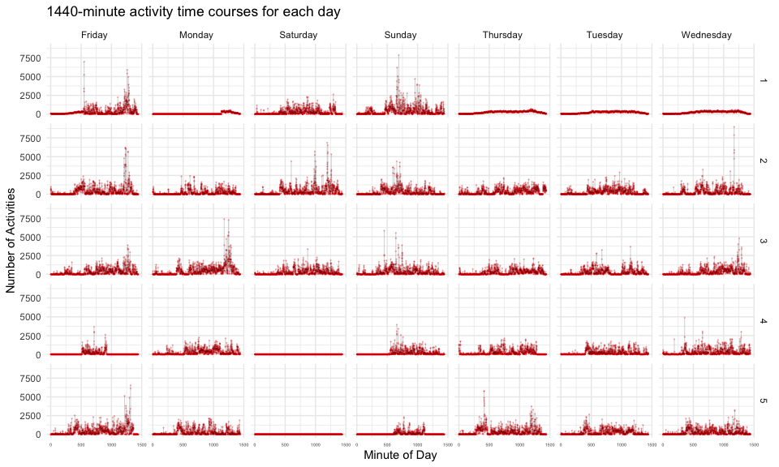

p8105_hw3_tl3196
================
Tianshu Liu

``` r
library(tidyverse)
library(ggplot2)
```

## Problem 1

``` r
library(p8105.datasets)
data("instacart")
```

The instacart data set is `1384617`×`15`.

The variables contain
`order_id, product_id, add_to_cart_order, reordered, user_id, eval_set, order_number, order_dow, order_hour_of_day, days_since_prior_order, product_name, aisle_id, department_id, aisle, department`,
the data type in each variable is shown in the table below:

| col_names              | col_types |
|:-----------------------|:----------|
| order_id               | integer   |
| product_id             | integer   |
| add_to_cart_order      | integer   |
| reordered              | integer   |
| user_id                | integer   |
| eval_set               | character |
| order_number           | integer   |
| order_dow              | integer   |
| order_hour_of_day      | integer   |
| days_since_prior_order | integer   |
| product_name           | character |
| aisle_id               | integer   |
| department_id          | integer   |
| aisle                  | character |
| department             | character |

``` r
aisle_count = 
instacart %>%
  group_by(aisle) %>%
  summarise(n = n()) %>%
  arrange(desc(n))

aisle_count
```

    ## # A tibble: 134 × 2
    ##    aisle                              n
    ##    <chr>                          <int>
    ##  1 fresh vegetables              150609
    ##  2 fresh fruits                  150473
    ##  3 packaged vegetables fruits     78493
    ##  4 yogurt                         55240
    ##  5 packaged cheese                41699
    ##  6 water seltzer sparkling water  36617
    ##  7 milk                           32644
    ##  8 chips pretzels                 31269
    ##  9 soy lactosefree                26240
    ## 10 bread                          23635
    ## # … with 124 more rows

The instacart data set contains `134` aisles.

Make a plot that shows the number of items ordered in each aisle,
limiting this to aisles with more than 10000 items ordered. Arrange
aisles sensibly, and organize your plot so others can read it.

``` r
aisle_count %>%
  filter(n > 10000) %>%
  ggplot(aes(x = reorder(aisle, -n), y = n)) +
  geom_bar(stat="identity", fill = "lightblue")+
  labs(
    x = "Aisles",
    y = "Number of Items",
    title = "Number of Items Ordered in the Top Aisles",
    caption = "@instacart"
  ) +
  theme_minimal() +
  theme(axis.text.x = element_text(angle = 90, hjust = 1)) 
```

<!-- -->

Make a table showing the three most popular items in each of the aisles
“baking ingredients”, “dog food care”, and “packaged vegetables fruits”.
Include the number of times each item is ordered in your table.

``` r
instacart %>%
  filter(aisle %in% c("baking ingredients", "dog food care", "packaged vegetables fruits")) %>%
  select(product_name, aisle) %>% 
  group_by(aisle, product_name) %>%
  summarise(
    n_product = n()
  ) %>% 
  mutate(
    product_rank = min_rank(desc(n_product))
  ) %>% 
  filter(product_rank < 4) %>% 
  arrange(aisle, product_rank)
```

    ## # A tibble: 9 × 4
    ## # Groups:   aisle [3]
    ##   aisle                      product_name                        n_pro…¹ produ…²
    ##   <chr>                      <chr>                                 <int>   <int>
    ## 1 baking ingredients         Light Brown Sugar                       499       1
    ## 2 baking ingredients         Pure Baking Soda                        387       2
    ## 3 baking ingredients         Cane Sugar                              336       3
    ## 4 dog food care              Snack Sticks Chicken & Rice Recipe…      30       1
    ## 5 dog food care              Organix Chicken & Brown Rice Recipe      28       2
    ## 6 dog food care              Small Dog Biscuits                       26       3
    ## 7 packaged vegetables fruits Organic Baby Spinach                   9784       1
    ## 8 packaged vegetables fruits Organic Raspberries                    5546       2
    ## 9 packaged vegetables fruits Organic Blueberries                    4966       3
    ## # … with abbreviated variable names ¹​n_product, ²​product_rank

Make a table showing the mean hour of the day at which Pink Lady Apples
and Coffee Ice Cream are ordered on each day of the week; format this
table for human readers (i.e. produce a 2 x 7 table).

``` r
instacart %>% 
  filter(product_name %in% c("Pink Lady Apples", "Coffee Ice Cream")) %>% 
  group_by(product_name, order_dow) %>% 
  summarise(
    mean_order_hour = mean(order_hour_of_day)
  ) %>% 
  mutate(
    order_dow = factor(
      order_dow,levels=0:6,
      labels=c("Sunday", "Monday", "Tuesday", "Wednesday", "Thursday", "Friday", "Saturday"))
  ) %>% 
  pivot_wider(
    names_from = order_dow,
    values_from = mean_order_hour
  )
```

    ## # A tibble: 2 × 8
    ## # Groups:   product_name [2]
    ##   product_name     Sunday Monday Tuesday Wednesday Thursday Friday Saturday
    ##   <chr>             <dbl>  <dbl>   <dbl>     <dbl>    <dbl>  <dbl>    <dbl>
    ## 1 Coffee Ice Cream   13.8   14.3    15.4      15.3     15.2   12.3     13.8
    ## 2 Pink Lady Apples   13.4   11.4    11.7      14.2     11.6   12.8     11.9

# Problem 2

Import data from `accel_data.csv`.

``` r
accel_df = read_csv("./data/accel_data.csv") %>% 
  janitor::clean_names() %>% 
  pivot_longer(
    cols = activity_1:activity_1440,
    names_prefix = "activity_",
    names_to = "minute_of_day",
    names_transform = list(minute_of_day = as.integer),
    values_to = "n_activity"
  ) %>% 
  mutate(
    weekday = ifelse(day %in% c("Saturday", "Sunday"), FALSE, TRUE),
    week = as.integer(week),
    day_id = as.integer(day_id)
  ) %>%
  relocate(weekday, .after = day)

accel_df
```

    ## # A tibble: 50,400 × 6
    ##     week day_id day    weekday minute_of_day n_activity
    ##    <int>  <int> <chr>  <lgl>           <int>      <dbl>
    ##  1     1      1 Friday TRUE                1       88.4
    ##  2     1      1 Friday TRUE                2       82.2
    ##  3     1      1 Friday TRUE                3       64.4
    ##  4     1      1 Friday TRUE                4       70.0
    ##  5     1      1 Friday TRUE                5       75.0
    ##  6     1      1 Friday TRUE                6       66.3
    ##  7     1      1 Friday TRUE                7       53.8
    ##  8     1      1 Friday TRUE                8       47.8
    ##  9     1      1 Friday TRUE                9       55.5
    ## 10     1      1 Friday TRUE               10       43.0
    ## # … with 50,390 more rows

This data set records five weeks of accelerometer data collected on a 63
year-old male with BMI 25, who was admitted to the Advanced Cardiac Care
Center of Columbia University Medical Center and diagnosed with
congestive heart failure (CHF).

This data set contains `6` variables, which are
`week, day_id, day, weekday, minute_of_day, n_activity`. The variables,
data types and explanations are shown in the table below:

| col_names     | col_types | explanation                                  |
|:--------------|:----------|:---------------------------------------------|
| week          | integer   | which week in the obervation period          |
| day_id        | integer   | which day in the observation period          |
| day           | character | what day is it                               |
| weekday       | logical   | it is on weekday or not                      |
| minute_of_day | integer   | the minute of a day                          |
| n_activity    | numeric   | number of activities happeded in this minute |

There are `50400` rows of observations in the data set.

Then, analyze the accelerometer data focus on the total activity over
the day.

``` r
day_total_act = 
  accel_df %>%
  group_by(day_id, day) %>% 
  summarise(
    day_total_activity = sum(n_activity)
  )

day_total_act
```

    ## # A tibble: 35 × 3
    ## # Groups:   day_id [35]
    ##    day_id day       day_total_activity
    ##     <int> <chr>                  <dbl>
    ##  1      1 Friday               480543.
    ##  2      2 Monday                78828.
    ##  3      3 Saturday             376254 
    ##  4      4 Sunday               631105 
    ##  5      5 Thursday             355924.
    ##  6      6 Tuesday              307094.
    ##  7      7 Wednesday            340115.
    ##  8      8 Friday               568839 
    ##  9      9 Monday               295431 
    ## 10     10 Saturday             607175 
    ## # … with 25 more rows

``` r
day_total_act %>% 
  ggplot(aes(x = day_id, y = day_total_activity))+
  geom_line(color = "blue") +
  theme_minimal() +
  labs(
    title = "Total activities over the day"
  )
```

<!-- -->

From the table and line-plot, there is not apparent trend of the total
activities over each day in the observation period.

``` r
accel_df %>% 
  mutate(
    day_id = as.character(day_id),
    week = as.character(week)
  ) %>% 
  ggplot(aes(x = minute_of_day, y = n_activity)) +
  labs(
    x = "Minute of Day",
    y = "Number of Activities",
    title = "24-hour activity time courses for each day"
  ) +
  geom_point(size = .1, alpha = .2, color = "red") + 
  geom_line(size = .1, alpha = .5) +
  theme_minimal() +
  facet_grid(cols = vars(day), rows = vars(week))
```

<!-- -->

From the plots of 5 weeks, we can conclude that the number of activities
happened per day first increses

# Problem 3

Import data from p8105 datasets.

``` r
library(p8105.datasets)
data("ny_noaa")
```
