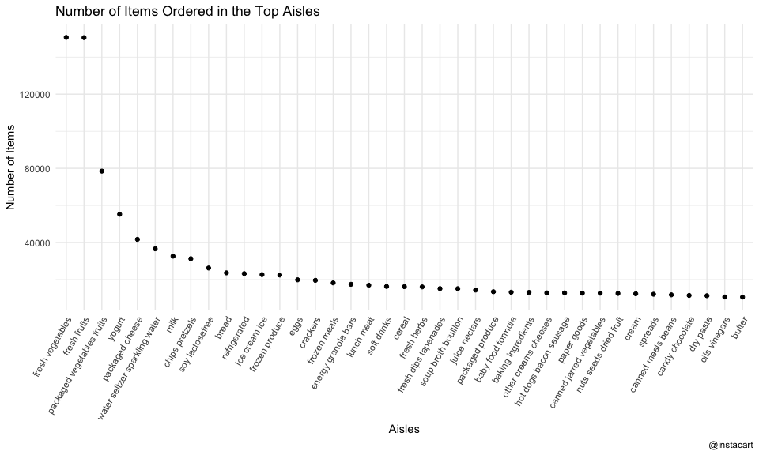
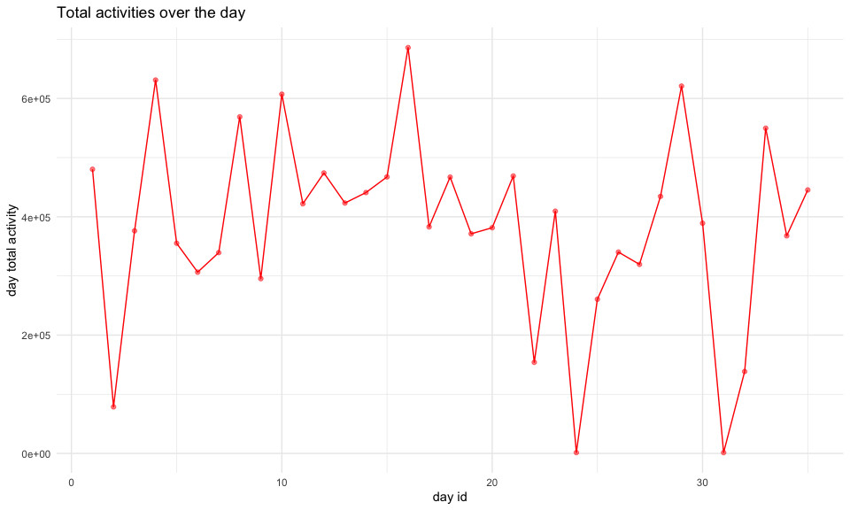
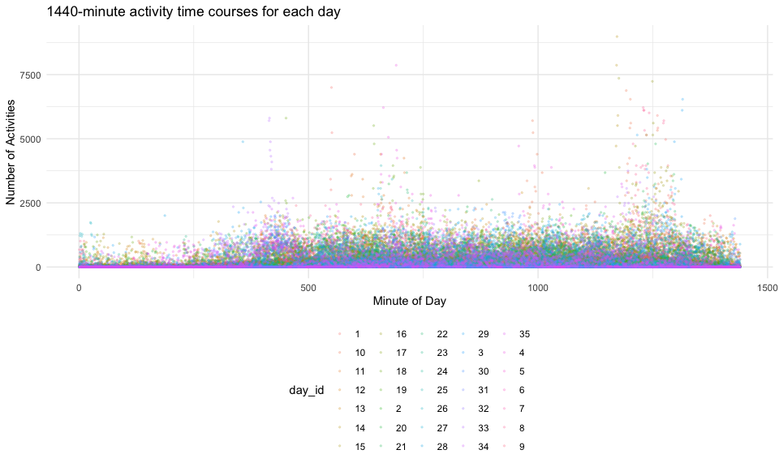
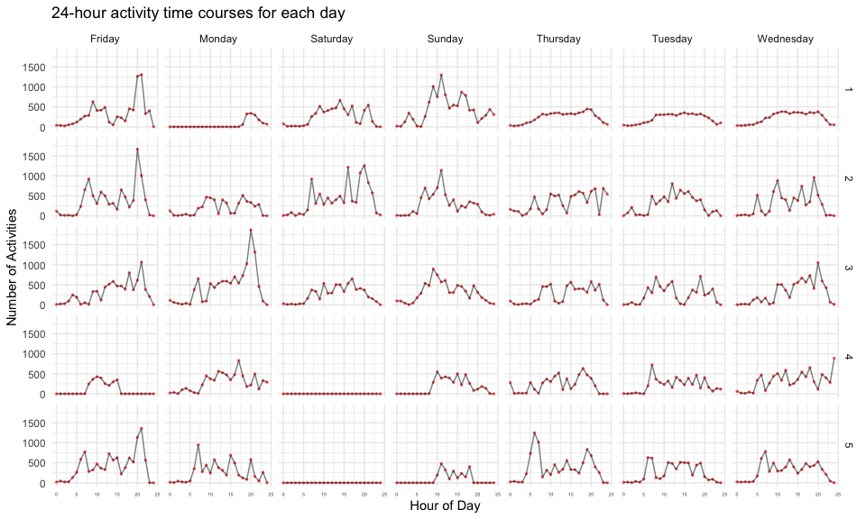
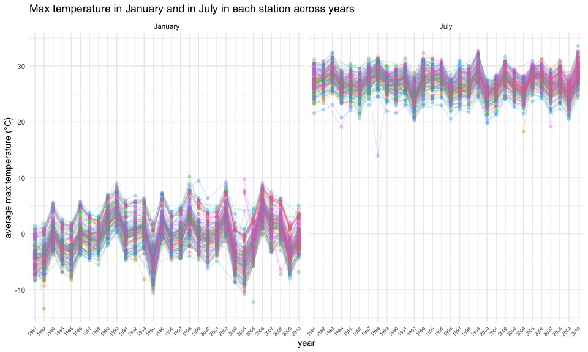
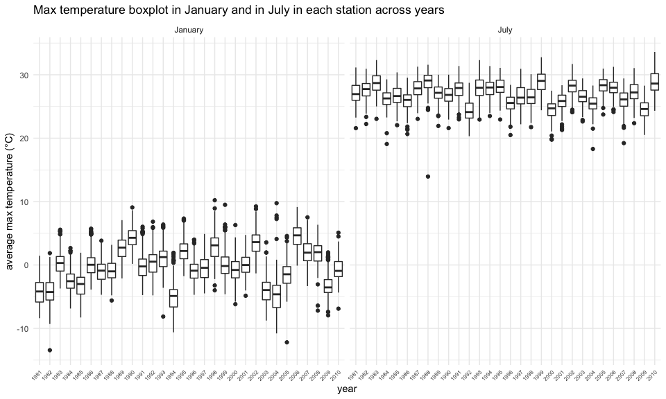

p8105_hw3_tl3196
================
Tianshu Liu

``` r
library(tidyverse)
library(ggplot2)
library(patchwork)
```

## Problem 1

``` r
library(p8105.datasets)
data("instacart")
```

The instacart data set is `1384617`×`15`, with each row resprenting a
single product from an instacart order.

The variables contain
`order_id, product_id, add_to_cart_order, reordered, user_id, eval_set, order_number, order_dow, order_hour_of_day, days_since_prior_order, product_name, aisle_id, department_id, aisle, department`,
the data type in each variable is shown in the table below:

| col_names              | col_types |
|:-----------------------|:----------|
| order_id               | integer   |
| product_id             | integer   |
| add_to_cart_order      | integer   |
| reordered              | integer   |
| user_id                | integer   |
| eval_set               | character |
| order_number           | integer   |
| order_dow              | integer   |
| order_hour_of_day      | integer   |
| days_since_prior_order | integer   |
| product_name           | character |
| aisle_id               | integer   |
| department_id          | integer   |
| aisle                  | character |
| department             | character |

``` r
aisle_count = 
instacart %>%
  group_by(aisle) %>%
  summarise(n = n()) %>%
  arrange(desc(n))

aisle_count
```

    ## # A tibble: 134 × 2
    ##    aisle                              n
    ##    <chr>                          <int>
    ##  1 fresh vegetables              150609
    ##  2 fresh fruits                  150473
    ##  3 packaged vegetables fruits     78493
    ##  4 yogurt                         55240
    ##  5 packaged cheese                41699
    ##  6 water seltzer sparkling water  36617
    ##  7 milk                           32644
    ##  8 chips pretzels                 31269
    ##  9 soy lactosefree                26240
    ## 10 bread                          23635
    ## # … with 124 more rows

The instacart data set contains `134` aisles.

Make a plot that shows the number of items ordered in each aisle,
limiting this to aisles with more than 10000 items ordered.

``` r
aisle_count %>%
  filter(n > 10000) %>%
  ggplot(aes(x = reorder(aisle, -n), y = n)) +
  geom_point()+
  labs(
    x = "Aisles",
    y = "Number of Items",
    title = "Number of Items Ordered in the Top Aisles",
    caption = "@instacart"
  ) +
  theme_minimal() +
  theme(axis.text.x = element_text(angle = 60, hjust = 1)) 
```

<!-- -->

Make a table showing the three most popular items in each of the aisles
“baking ingredients”, “dog food care”, and “packaged vegetables fruits”.

``` r
instacart %>%
  filter(aisle %in% c("baking ingredients", "dog food care", "packaged vegetables fruits")) %>%
  select(product_name, aisle) %>% 
  group_by(aisle, product_name) %>%
  summarise(
    n_product = n()
  ) %>% 
  mutate(
    product_rank = min_rank(desc(n_product))
  ) %>% 
  filter(product_rank < 4) %>% 
  arrange(aisle, product_rank)
```

    ## # A tibble: 9 × 4
    ## # Groups:   aisle [3]
    ##   aisle                      product_name                        n_pro…¹ produ…²
    ##   <chr>                      <chr>                                 <int>   <int>
    ## 1 baking ingredients         Light Brown Sugar                       499       1
    ## 2 baking ingredients         Pure Baking Soda                        387       2
    ## 3 baking ingredients         Cane Sugar                              336       3
    ## 4 dog food care              Snack Sticks Chicken & Rice Recipe…      30       1
    ## 5 dog food care              Organix Chicken & Brown Rice Recipe      28       2
    ## 6 dog food care              Small Dog Biscuits                       26       3
    ## 7 packaged vegetables fruits Organic Baby Spinach                   9784       1
    ## 8 packaged vegetables fruits Organic Raspberries                    5546       2
    ## 9 packaged vegetables fruits Organic Blueberries                    4966       3
    ## # … with abbreviated variable names ¹​n_product, ²​product_rank

Make a table showing the mean hour of the day at which Pink Lady Apples
and Coffee Ice Cream are ordered on each day of the week:

``` r
instacart %>% 
  filter(product_name %in% c("Pink Lady Apples", "Coffee Ice Cream")) %>% 
  group_by(product_name, order_dow) %>% 
  summarise(
    mean_order_hour = mean(order_hour_of_day)
  ) %>% 
  mutate(
    order_dow = factor(
      order_dow,levels=0:6,
      labels=c("Sunday", "Monday", "Tuesday", "Wednesday", "Thursday", "Friday", "Saturday"))
  ) %>% 
  pivot_wider(
    names_from = order_dow,
    values_from = mean_order_hour
  )
```

    ## # A tibble: 2 × 8
    ## # Groups:   product_name [2]
    ##   product_name     Sunday Monday Tuesday Wednesday Thursday Friday Saturday
    ##   <chr>             <dbl>  <dbl>   <dbl>     <dbl>    <dbl>  <dbl>    <dbl>
    ## 1 Coffee Ice Cream   13.8   14.3    15.4      15.3     15.2   12.3     13.8
    ## 2 Pink Lady Apples   13.4   11.4    11.7      14.2     11.6   12.8     11.9

# Problem 2

Import data from `accel_data.csv`.

``` r
accel_df = read_csv("./data/accel_data.csv") %>% 
  janitor::clean_names() %>% 
  pivot_longer(
    cols = activity_1:activity_1440,
    names_prefix = "activity_",
    names_to = "minute_of_day",
    names_transform = list(minute_of_day = as.integer),
    values_to = "n_activity",
    values_transform = list(n_activity = as.integer)
  ) %>% 
  mutate(
    weekday_vs_weekend = as.factor(ifelse(day %in% c("Saturday", "Sunday"), "weekend", "weekday")),
    week = as.integer(week),
    day_id = as.integer(day_id)
  ) %>%
  relocate(weekday_vs_weekend, .after = day)

accel_df
```

    ## # A tibble: 50,400 × 6
    ##     week day_id day    weekday_vs_weekend minute_of_day n_activity
    ##    <int>  <int> <chr>  <fct>                      <int>      <int>
    ##  1     1      1 Friday weekday                        1         88
    ##  2     1      1 Friday weekday                        2         82
    ##  3     1      1 Friday weekday                        3         64
    ##  4     1      1 Friday weekday                        4         70
    ##  5     1      1 Friday weekday                        5         75
    ##  6     1      1 Friday weekday                        6         66
    ##  7     1      1 Friday weekday                        7         53
    ##  8     1      1 Friday weekday                        8         47
    ##  9     1      1 Friday weekday                        9         55
    ## 10     1      1 Friday weekday                       10         42
    ## # … with 50,390 more rows

This data set records five weeks of accelerometer data collected on a 63
year-old male with BMI 25, who was admitted to the Advanced Cardiac Care
Center of Columbia University Medical Center and diagnosed with
congestive heart failure (CHF).

This data set contains `6` variables, which are
`week, day_id, day, weekday_vs_weekend, minute_of_day, n_activity`. The
variables’ data types and description are shown in the table below:

| col_names          | col_types | description                                  |
|:-------------------|:----------|:---------------------------------------------|
| week               | integer   | which week in the obervation period          |
| day_id             | integer   | which day in the observation period          |
| day                | character | what day is it (eg. Monday, Tuesday, etc.)   |
| weekday_vs_weekend | factor    | it is on weekday or weekend                  |
| minute_of_day      | integer   | the minute of a day                          |
| n_activity         | integer   | number of activities happeded in this minute |

There are `50400` rows of observations in the data set.

Then, analyze the accelerometer data focus on the total activity over
the day.

``` r
day_total_act = 
  accel_df %>%
  group_by(day_id, day, weekday_vs_weekend) %>% 
  summarise(
    day_total_activity = sum(n_activity)
  )

day_total_act
```

    ## # A tibble: 35 × 4
    ## # Groups:   day_id, day [35]
    ##    day_id day       weekday_vs_weekend day_total_activity
    ##     <int> <chr>     <fct>                           <int>
    ##  1      1 Friday    weekday                        480280
    ##  2      2 Monday    weekday                         78674
    ##  3      3 Saturday  weekend                        376254
    ##  4      4 Sunday    weekend                        631105
    ##  5      5 Thursday  weekday                        355218
    ##  6      6 Tuesday   weekday                        306377
    ##  7      7 Wednesday weekday                        339402
    ##  8      8 Friday    weekday                        568839
    ##  9      9 Monday    weekday                        295431
    ## 10     10 Saturday  weekend                        607175
    ## # … with 25 more rows

``` r
day_total_act %>% 
  ggplot(aes(x = day_id, y = day_total_activity))+
  geom_point(color = "red", alpha = .5) +
  geom_line(color = "red") +
  labs(
    x = "day id",
    y = "day total activity",
    title = "Total activities over the day"
  )+
  theme_minimal()
```

<!-- -->

From the table and line-plot, there is not apparent trend of the total
activities over each day in the observation period.

Generate 1440-minute activity time course graph for each day in the
observation period.

``` r
accel_df %>% 
  mutate(
    day_id = as.character(day_id),
    week = as.character(week)
  ) %>% 
  ggplot(aes(x = minute_of_day, y = n_activity, color = day_id)) +
  labs(
    x = "Minute of Day",
    y = "Number of Activities",
    title = "1440-minute activity time courses for each day"
  ) +
  geom_point(size = .5, alpha = .2) + 
  theme_minimal()+
  theme(legend.position = "bottom")
```

<!-- -->

There are too many points to find any explicit conclusions about the
activities. Use `facet_grid` function to generate separate graphs for
each day.

``` r
accel_df %>% 
  mutate(
    day_id = as.character(day_id),
    week = as.character(week)
  ) %>% 
  ggplot(aes(x = minute_of_day, y = n_activity)) +
  labs(
    x = "Minute of Day",
    y = "Number of Activities",
    title = "1440-minute activity time courses for each day"
  ) +
  geom_point(size = .1, alpha = .2, color = "red") + 
  geom_line(size = .1, alpha = .5) +
  theme_minimal() +
  facet_grid(cols = vars(day), rows = vars(week))+
  theme(axis.text.x = element_text(size = 4)) 
```

<!-- -->

Since there are too many points in each day’s graph, it is not clear
enough to find data patterns from the messy points and lines. To
represent the number of activity in each hour, calculate the mean of
n_activity grouped by each hour in each day, and plot the graph again.

``` r
accel_df %>% 
  mutate(
    day_id = as.character(day_id),
    week = as.character(week),
    hour = floor(minute_of_day / 60)
  ) %>% 
  group_by(week, day_id, day, hour) %>% 
  summarise(
    mean_activity = mean(n_activity)
  ) %>% 
  ggplot(aes(x = hour, y = mean_activity)) +
  labs(
    x = "Hour of Day",
    y = "Number of Activities",
    title = "24-hour activity time courses for each day"
  ) +
  geom_point(size = .5, alpha = .5, color = "red") + 
  geom_line(size = .5, alpha = .5) +
  theme_minimal() +
  facet_grid(cols = vars(day), rows = vars(week))+
  theme(axis.text.x = element_text(size = 4)) 
```

<!-- -->

From the two graphs above, we can find some patterns and conclusions:

-   The number of activity apparently increases after 5 or 6 am, when
    the patient may get up every day and thus have more motions,
    decreases at around 8 pm, fluctuates at noon, then increases again
    in the afternoon, and finally decreases to around 0 after 10 pm,
    when the patient may fall asleep.
-   The patient’s most active period of time of each day is between 8 am
    to 10 pm.
-   The peak of activity counts often appears at around 8 am in the
    morning, and at around 8 pm in the evening. The peak of activity
    numbers always appears at around 8 pm on each Friday and Monday, at
    around 12 pm on Sunday.
-   The patient had fewer activities than normal on the 2nd, 5th, 6th,
    7th, 22nd, 24th, 31st, 32nd day, which indicates that he might feel
    sick on these days or he didn’t take the accelerometer
    appropriately.
-   In the 2nd and 3rd week, which contains relatively normal data of
    activity, the patient’s activity is relatively fixed in each days of
    each week.

# Problem 3

Import data from p8105 datasets.

``` r
#Import data from p8105

library(p8105.datasets)
data("ny_noaa")
```

This data contains important weather variables collected by all New York
state weather stations from January 1, 1981 through December 31, 2010.

This data set is `2595176`×`7`.

It contains `7` variables, which are
`id, date, prcp, snow, snwd, tmax, tmin`. The variables’ types in the
original data set and descriptions are shown in the table below:

| col_names | col_types | description                    |
|:----------|:----------|:-------------------------------|
| id        | character | Weather station id             |
| date      | Date      | Date of observation            |
| prcp      | integer   | Precipitaion (mm)              |
| snow      | integer   | Snowfall (mm)                  |
| snwd      | integer   | Snow depth (mm)                |
| tmax      | character | Maximum temperature (degree C) |
| tmin      | character | Minimum temperature (degree C) |

Though the data set contains `2595176` rows of observations, `1372743`
rows of observations in total contain `NA` data, which means `52.90%` of
the observations contained in this data set have `NA` data.

The table below shows the number and proportion of `NA` in each columns:

| col_names |    n_na | percent |
|:----------|--------:|:--------|
| id        |       0 | 0.00%   |
| date      |       0 | 0.00%   |
| prcp      |  145838 | 5.62%   |
| snow      |  381221 | 14.69%  |
| snwd      |  591786 | 22.80%  |
| tmax      | 1134358 | 43.71%  |
| tmin      | 1134420 | 43.71%  |

Since such significant proportion of NA existing in the data set, the
missing values can be considered an issue in data analysis.

Check the frequent values in temperature, precipitation, and snowfall by
plotting histograms for each varible.

Before checking whether the units used in the data set is reasonable,
let’s make a little edit to the original data set. The current types for
variables `tmin` and `tmax` are both `character` in the original data
set, which is not convenient in analysis. Thus, change the type of
`tmin` and `tmax` to integer in advance.

``` r
ny_noaa = 
  ny_noaa %>% 
  mutate(
    tmin = as.integer(tmin),
    tmax = as.integer(tmax)
  )
```

Check the current value characteristics of each variable in the data
set.

``` r
ny_noaa %>% summary()
```

    ##       id                 date                 prcp               snow       
    ##  Length:2595176     Min.   :1981-01-01   Min.   :    0.00   Min.   :  -13   
    ##  Class :character   1st Qu.:1988-11-29   1st Qu.:    0.00   1st Qu.:    0   
    ##  Mode  :character   Median :1997-01-21   Median :    0.00   Median :    0   
    ##                     Mean   :1997-01-01   Mean   :   29.82   Mean   :    5   
    ##                     3rd Qu.:2005-09-01   3rd Qu.:   23.00   3rd Qu.:    0   
    ##                     Max.   :2010-12-31   Max.   :22860.00   Max.   :10160   
    ##                                          NA's   :145838     NA's   :381221  
    ##       snwd             tmax              tmin        
    ##  Min.   :   0.0   Min.   :-389.0    Min.   :-594.0   
    ##  1st Qu.:   0.0   1st Qu.:  50.0    1st Qu.: -39.0   
    ##  Median :   0.0   Median : 150.0    Median :  33.0   
    ##  Mean   :  37.3   Mean   : 139.8    Mean   :  30.3   
    ##  3rd Qu.:   0.0   3rd Qu.: 233.0    3rd Qu.: 111.0   
    ##  Max.   :9195.0   Max.   : 600.0    Max.   : 600.0   
    ##  NA's   :591786   NA's   :1134358   NA's   :1134420

Max/Min of `tmax` and `tmin` can almost reach ± 400 C, which is
impossible for the temperature. Thus, the value of `tmax` and `tmin`
should be divided by `10`.

The unit of snowfall is reasonable, which don’t need converting.

The unit of precipitation should also be divided by `10`.

``` r
ny_noaa = 
  ny_noaa %>% 
  separate(date,
           into = c("year", "month", "day"),
           sep = "-",
           convert = TRUE) %>% 
  mutate(
    tmin = tmin / 10,
    tmax = tmax / 10,
    prcp = prcp / 10
  )
```

``` r
ny_noaa %>% 
  drop_na(snow) %>% 
  group_by(snow) %>% 
  summarise(
    snow_count = n()
  ) %>% 
  arrange(-snow_count)
```

    ## # A tibble: 281 × 2
    ##     snow snow_count
    ##    <int>      <int>
    ##  1     0    2008508
    ##  2    25      31022
    ##  3    13      23095
    ##  4    51      18274
    ##  5    76      10173
    ##  6     8       9962
    ##  7     5       9748
    ##  8    38       9197
    ##  9     3       8790
    ## 10   102       6552
    ## # … with 271 more rows

The most commonly observed value of snowfall is `0`, since most of the
days in New York in a year do not have snowfall. Even in winter, it does
not snow every day.

``` r
ny_noaa %>% 
  drop_na(tmax) %>% 
  filter(month %in% c(1, 7)) %>% 
  mutate(
    year = as.character(year),
    month = ifelse(month == 1, "January", "July")
  ) %>% 
  group_by(id, year, month) %>% 
  summarise(
    avg_tmax = mean(tmax)
  ) %>% 
  ggplot(aes(x = year, y = avg_tmax, group = id)) + 
  geom_point(aes(color = id), alpha = .3) +
  geom_line(aes(color = id), alpha = .2) +
  labs(
    x = "year", 
    y = "average max temperature (°C)",
    title = "Max temperature in January and in July in each station across years"
  ) +
  theme_minimal() +
  theme(axis.text.x = element_text(size=6, angle = 45, hjust = 1),
        legend.position = "none") +
  facet_grid(cols = vars(month)) 
```

<!-- -->

From the graph above, we can find some observable / interpretable
structures:

-   The max temperature in January fluctuated across years, while the
    max temperature in July was relatively more stable.
-   The max temperatures measured by different stations were basically
    convergent in trend.
-   The max temperature in January was apparently lower than in July
    from 1981 to 2012.

``` r
ny_noaa %>% 
  drop_na(tmax) %>% 
  filter(month %in% c(1, 7)) %>% 
  mutate(
    year = as.character(year),
    month = ifelse(month == 1, "January", "July")
  ) %>% 
  group_by(id, year, month) %>% 
  summarise(
    avg_tmax = mean(tmax)
  ) %>% 
  ggplot(aes(x = year, y = avg_tmax)) + 
  geom_boxplot() +
  labs(
    x = "year", 
    y = "average max temperature (°C)",
    title = "Max temperature boxplot in January and in July in each station across years"
  ) +
  theme_minimal() +
  theme(axis.text.x = element_text(size=6, angle = 45, hjust = 1),
        legend.position = "none") +
  facet_grid(cols = vars(month)) 
```

<!-- -->

In the box-plot above, it is clear to find some outliers, such as the
mean max temperature in January 1982 measured by `USC00301723` and July
1988 measured by `USC00308962`.

``` r
tmin_vs_tmax = 
  ny_noaa %>% 
  drop_na(tmax, tmin) %>% 
  ggplot(aes(x = tmin, y = tmax)) +
  geom_hex() +
  labs(
    title = "tmax vs. tmin",
    x = "tmin (°C)",
    y = "tmax (°C)"
  ) + 
  theme_minimal() + 
  theme(legend.position = "bottom")
```

``` r
snowfall = 
  ny_noaa %>% 
  filter(
    snow > 0,
    snow < 100
  ) %>% 
  mutate(
    year = as.character(year)
  ) %>% 
  ggplot(aes(x = snow, color = year)) + 
  geom_density() +
  labs(
    x = "snowfall (mm)",
    y = "density",
    title = "Distribution of snowfall values"
  ) + 
  theme_minimal() + 
  theme(legend.position = "bottom")

tmin_vs_tmax + snowfall
```

<!-- -->
